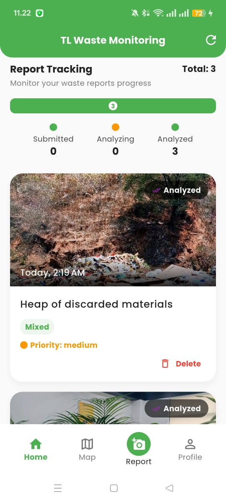
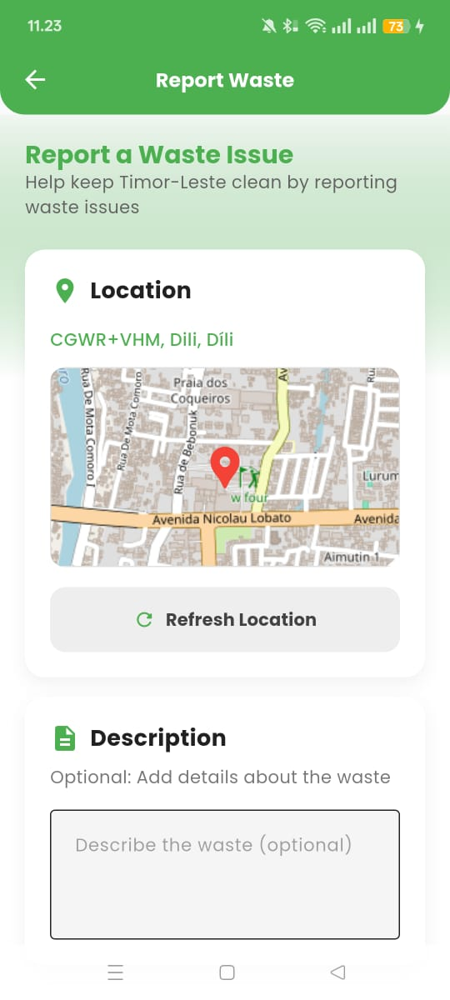
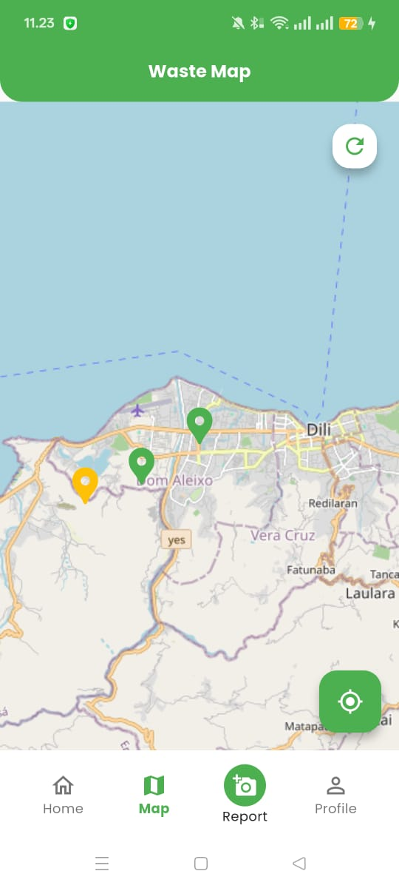
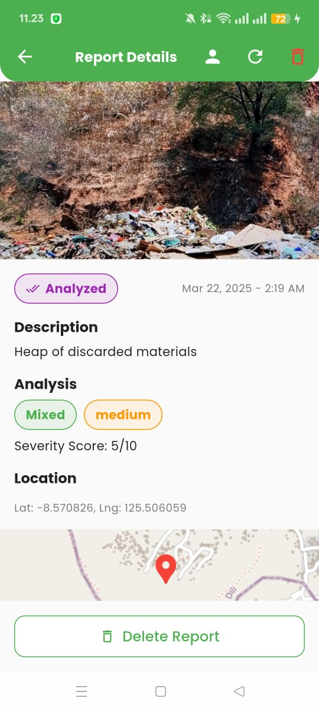

# TL Waste Report App


<p align="center">
  <a href="https://drive.google.com/drive/folders/1O2CP7oY6aVZOTpRaTXd6RO8T1DjITV4p?usp=sharing"><b>DOWNLOAD APP</b></a>  
  <br>  
  <i>Empowering the citizens of Timor-Leste to enhance waste management through community-driven reporting.</i>  
</p>


## 📱 Overview

TL Waste Report is a mobile application that enables citizens of Timor-Leste to easily report waste issues in their communities. Built with Flutter for cross-platform compatibility, this app serves as the front-end interface for the TL Digital Waste Monitoring Network, connecting citizens with waste management authorities and providing a platform for community-driven environmental improvement.

## ✨ Key Features

- **Simple Waste Reporting**: Capture and submit waste reports with photos, location data, and descriptions
- **Location Tracking**: Automatic GPS coordinates capture for precise waste mapping
- **Report Status Tracking**: Follow the progress of submitted reports through analysis and resolution
- **Interactive Map**: View waste reports and hotspots in your community
- **AI-Powered Analysis**: Receive feedback on waste type and severity through backend AI analysis


## 🔧 Technical Architecture

The app follows a provider-based architecture with the following components:

- **UI Layer**: Flutter widgets for responsive and intuitive user interface
- **Business Logic**: Provider-based state management
- **Data Layer**: Repository pattern for data access and manipulation
- **Network Layer**: REST API communication with the backend service
- **Local Storage**: SQLite database for offline functionality

## 📸 Screenshots

<p align="center">
  
  
  
  
</p>

## 🚀 Getting Started

### Prerequisites

- Flutter SDK (2.12.0 or higher)
- Dart SDK (2.14.0 or higher)
- Android Studio or VS Code with Flutter extensions
- An emulator or physical device for testing

### Installation

1. Clone the repository:
   ```bash
   git clone https://github.com/ajitonelsonn/tl_waste_report.git
   cd tl_waste_report
   ```

2. Install dependencies:
   ```bash
   flutter pub get
   ```

3. Create a `.env` file in the project root with the following variables:
   ```
   API_BASE_URL=https://your-api-base-url.com
   REPORTING_AGENT_URL=https://your-reporting-agent-url.com
   ```

4. Run the app:
   ```bash
   flutter run
   ```


## 🔄 User Flow

1. **Onboarding**: Users register or login with mobile number/email
2. **Home Screen**: Dashboard showing nearby waste issues and personal reports
3. **Report Creation**: Taking photos, adding descriptions, and submitting reports
4. **Status Tracking**: Monitoring report status from submission through analysis
5. **Map View**: Exploring waste reports and hotspots on an interactive map
6. **Profile**: Managing personal information and viewing submission history

## 🧩 Integration with TL Digital Waste Monitoring Network

This app is part of a larger ecosystem:

1. **Mobile App (this repo)**: Front-end interface for citizens
2. [**Reporting Agent**](https://github.com/ajitonelsonn/tl-waste-monitoring/tree/main/reporting): Processes report submissions
3. [**Analysis Agent**](https://github.com/ajitonelsonn/tl-waste-monitoring/tree/main/analysis): AI-powered waste classification
4. [**TL Waste Dashboard**](https://github.com/ajitonelsonn/tl-waste-dashboard): Web interface for public dashboard


## 🔍 Performance Considerations

The app is optimized for the specific conditions in Timor-Leste:

- **Low bandwidth usage**: Compressed images and efficient API calls
- **Battery efficiency**: Optimized location services and background processes
- **Storage efficiency**: Minimal local data storage with cleanup policies
- **Offline support**: Fully functional core features without constant connectivity

## 📚 Related Repositories

This app is part of the TL Digital Waste Monitoring Network:

- [TL Digital Waste Monitoring Network](https://github.com/ajitonelsonn/TLWasteR) - Main project overview
- [TL-WASTE-MONITORING](https://github.com/ajitonelsonn/tl-waste-monitoring) - Backend API and AI agents
- [TL Waste Dashboard](https://github.com/ajitonelsonn/tl-waste-dashboard) - Web dashboard for officials


## 🙏 Acknowledgments

- The Global AI Agents League Hackathon organizers
- [Fetch.ai](https://fetch.ai/) for the agent framework
- [ASI-1 Mini](https://asi1.ai/) for AI image analysis
- Flutter team for the amazing cross-platform framework
- The people of Timor-Leste for inspiring this environmental solution

---

For questions or support, please open an issue on GitHub or contact our team.